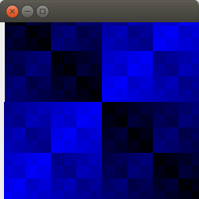
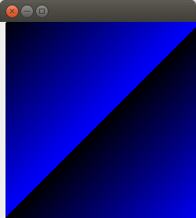
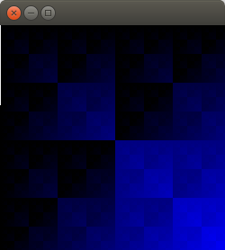

# function-to-image
A simple clojure code which will generate an image of 250x250 pixels with 
each pixel color value being generated by some function on its x and y co-ordinates 

For example 
The image generated by the pixel value = XOR(x, y)
;

The image generated by the pixel value = bitwise AND(x, y)
;

The image generated by the pixel value = addition(x, y)
;
